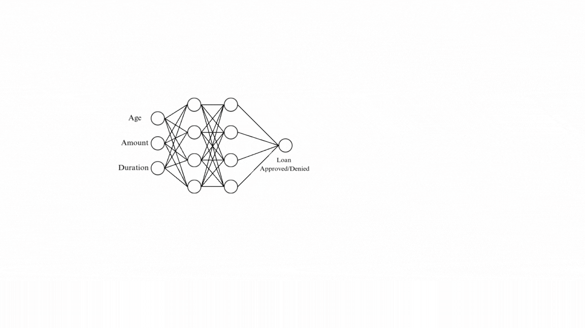
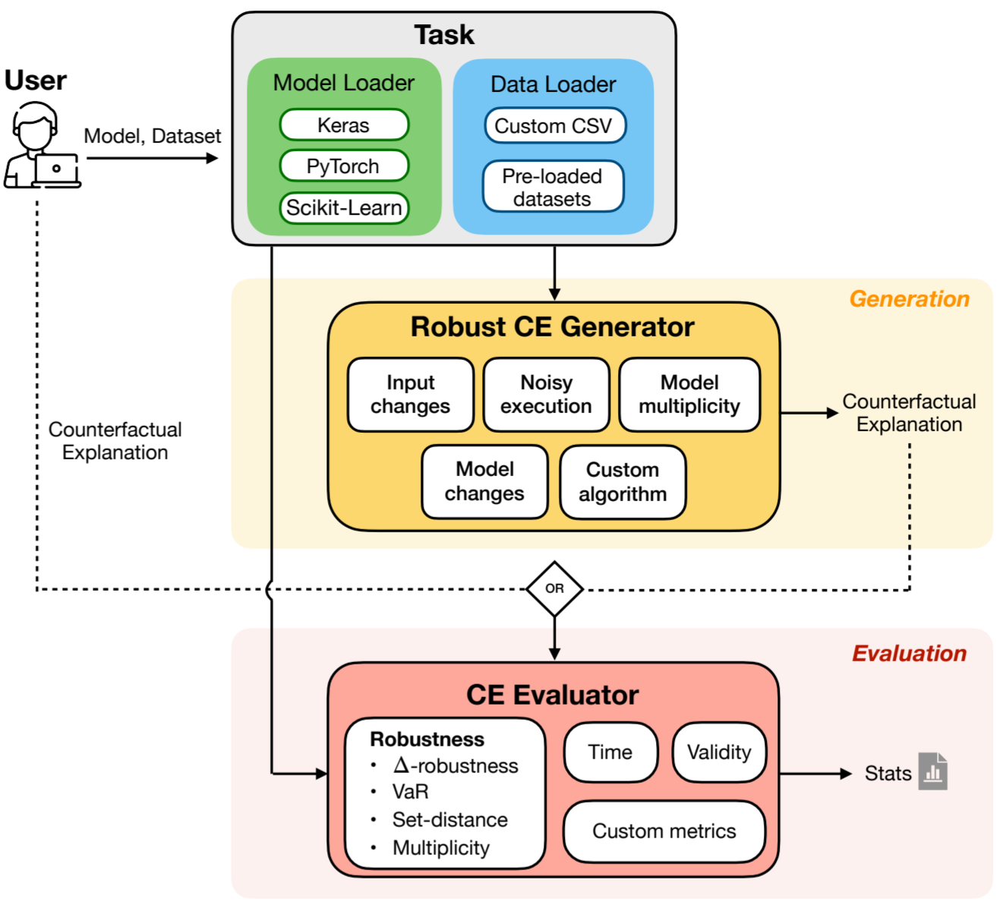

# RobustX   

RobustX is a Python library implementing a collection of generation and evaluation methods for Counterfactual Explanation (CE), with a focus on the robustness property.
It provides easy-to-use interfaces for implementing new CE methods and benchmarking performances against a range of robust methods. 

#### RobustX is accepted at [IJCAI 2025](https://2025.ijcai.org/) Demo track! 

See our technical report preprint [on ArXiv](https://arxiv.org/abs/2502.13751), and [read more about robust CE](https://www.ijcai.org/proceedings/2024/894).




## Features

<table>
  <tr>
    <td></td>
    <td>
      <ul>
        <li> Standardises the evaluation and benchmarking of robust CEs.</li>
        <li> Supports multiple ML frameworks, including PyTorch, Keras, and scikit-learn.</li>
        <li>Extensible to incorporate custom models, datasets, CE methods, and evaluation metrics.</li>
        <li>Includes robust CE generation methods (currently 9) and non-robust baselines.</li>      
      </ul>
    </td>
  </tr>
</table>

## Setup

The core required packages for working on RobustX are listed in ```environment.yml``` and ```requirements.txt```.

To set up a new virtual environment with Conda, use ```environment.yml```. This will install the required packages into a new environment called RobustX.

```bash
conda env create -f environment.yml
conda activate robustx
```

Then, start using the library by:

```
pip install -e .
```

Alternatively, if using an existing Python environment, directly run ```pip install -e .```

Note that one needs [Gurobi](https://www.gurobi.com/) optimizer to run mixed integer programming-based methods. Gurobi offers [free academic licenses](https://www.gurobi.com/downloads/end-user-license-agreement-academic/).

## Examples

A first example of RobustX is provided below.

```python
# first prepare a task
from robustx.datasets.ExampleDatasets import get_example_dataset
from robustx.lib.models.pytorch_models.SimpleNNModel import SimpleNNModel
from robustx.lib.tasks.ClassificationTask import ClassificationTask

data = get_example_dataset("ionosphere")
data.default_preprocess()
model = SimpleNNModel(34, [8], 1)
model.train(data.X, data.y)
task = ClassificationTask(model, data)

# specify the names of the methods and evaluations we want to use, run benchmarking
# This will find CEs for all instances predicted with the undesirable class (0) and compare
from robustx.lib import default_benchmark
methods = ["KDTreeNNCE", "MCE", "MCER", "RNCE", "STCE", "PROPLACE"]
evaluations = ["Validity", "Distance", "Delta-robustness"]
default_benchmark(task, methods, evaluations, neg_value=0, column_name="target", delta=0.005)
```
which will produce an output similar to:

| Method     | Execution Time (s) | Validity | Distance | Delta-robustness |
|------------|------------------:|---------:|---------:|-----------------:|
| KDTreeNNCE |          0.21686  |        1 |  5.76588 |        0.515625  |
| MCE        |          3.44478  |        1 |  3.26922 |        0         |
| MCER       |        137.563    |        1 |  5.14061 |        0.648438  |
| RNCE       |          3.98173  |        1 |  6.03255 |        1         |
| STCE       |         29.6889   |        1 |  6.86523 |        1         |
| PROPLACE   |         12.9444   |        1 |  5.96721 |        1         |


A demonstration of how to use the library is available here:

```bash
conda activate robustx
cd RobustX/demo
streamlit run demo_main.py --theme.base="light"   
```

Python notebooks demonstrating the usage of RobustX are
available [here](https://github.com/RobustCounterfactualX/RobustX/tree/main/examples).


## Documentations

See the documentations [here](https://robustcounterfactualx.github.io/RobustX/) (WIP).

## Contributors
* **Junqi Jiang** - junqi.jiang20@imperial.ac.uk
* **Luca Marzari** - luca.marzari@univr.it
* **Aaryan Purohit** 
* **Francesco Leofante** - f.leofante@imperial.ac.uk


## How to contribute to RobustX?

If you are interested in contributing to RobustX by implementing your CE generation method, you can follow this simple tutorial available [here](https://github.com/RobustCounterfactualX/RobustX/tree/main/examples/HowToContribute.ipynb). 

## Citation

If you find RobustX useful for your work, please cite our technical report:
```
@inproceedings{jiang2025robustx,
  title     = {RobustX: Robust Counterfactual Explanations Made Easy},
  author    = {Jiang, Junqi and Marzari, Luca and Purohit, Aaryan and Leofante, Francesco},
  booktitle = {Proceedings of the Thirty-Fourth International Joint Conference on Artificial Intelligence, {IJCAI-25}},
  publisher = {International Joint Conferences on Artificial Intelligence Organization},
  pages     = {11067--11071},
  year      = {2025},
  month     = {8},
  doi       = {10.24963/ijcai.2025/1264},
  url       = {https://doi.org/10.24963/ijcai.2025/1264},
}
```

## License

RobustX is licensed under the MIT License. For more details, please refer to the `LICENSE` file in this repository.
